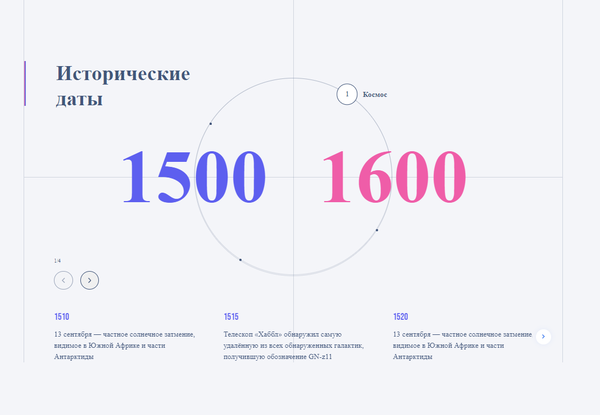

# Time-intervals
Time-intervals is a simple module provides ability to present date in time intervals case.
## Module appearance

## About

The block contains information about time periods, in each of which there are several events.
When switching time periods, the corresponding numbers change and a new slider is shown below them, which contains detailed information on key events in the active time period.

There may be from 2 to 6 time periods. All interactive points on the circle are located at the same distance from each other

## Usage

Import the component

use as a regular component

